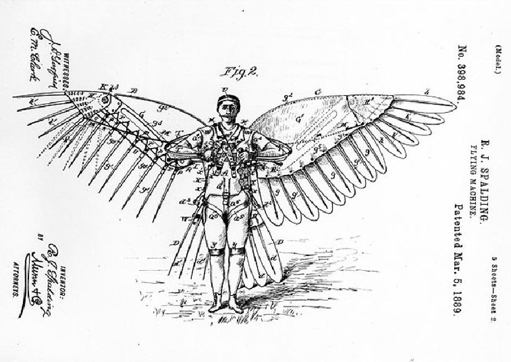
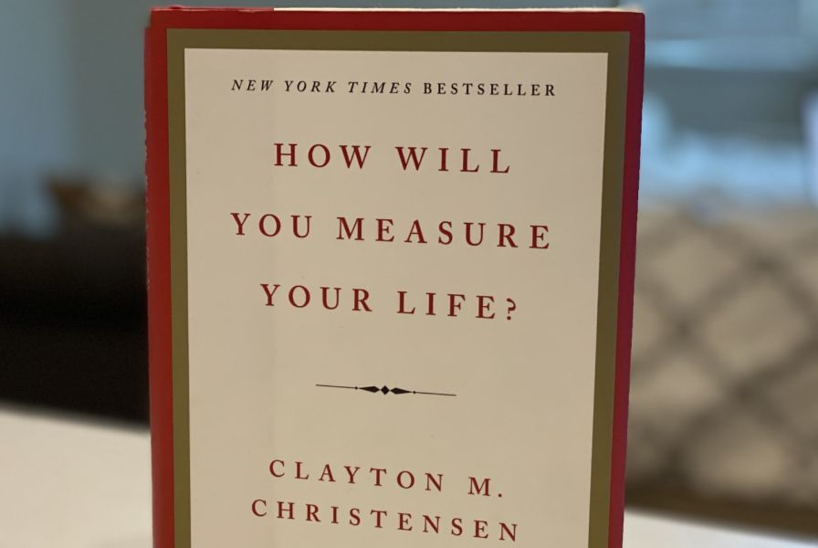

<!-- @@master = blog-template.html
{"title":"8 Lessons Product Managers Need to Learn From Clayton Christensen", "description":"The way you architect your work and your life make a meaningful long-term difference, for success or failure. Influential innovation scholar, Clayton Christensen, teaches key lessons every product manager should know.", "imageurl":"https://ryanseamons.com/assets/img/posts/clayton-product/clayton2.jpg", "url":"https://ryanseamons.com/christensen-product"}
-->

<!-- @@block = blog-post-->

# 8 Lessons Product Managers Need to Learn From Clayton Christensen

Clayton Christensen is one of the greatest business minds of our time. His recent passing caused me to reflect on all I learned from him. His life was dedicated to his family, his faith, and the theories he taught. He personified servant leadership.

Almost every single topic he taught is relevant to the work of product management. Here I share 8 key lessons I've learned from his work that have helped me be a better product manager, leader, entrepreneur, husband and father. 

1. <a href="#1-the-theory-of-disruptive-innovation" target="_self">The Theory of Disruptive Innovation</a>
2. <a href="#2-jobs-to-be-done" target="_self">Jobs to be Done</a>
3. <a href="#3-dont-outsource-core-capabilities" target="_self">Don't Outsource Core Capabilities</a>
4. <a href="#4-following-best-practices-doesnt-always-work" target="_self">The Pitfalls of Best Practices</a>
5. <a href="#5-how-you-measure-success-matters-resource-allocation" target="_self">How You Measure Success Matters</a>
6. <a href="#6-relationships-matter-especially-on-product-teams" target="_self">Relationships Matter</a>
7. <a href="#7-the-importance-of-figuring-out-and-communicating-the-strategy" target="_self">The Importance of Strategy</a>
8. <a href="#8-dont-let-personal-work-success-become-the-driving-force-in-your-life" target="_self">Success Beyond Work</a>

---
## 1. The theory of disruptive innovation

Clay's seminal work deals with this question: 

### **Why do big companies with lots of resources miss out on innovative solutions?**

[Disruptive innovation](https://www.youtube.com/watch?v=mbPiAzzGap0) is the theory that explains the answer. I encourage every PM to [read the book](https://www.amazon.com/Innovators-Dilemma-Technologies-Management-Innovation/dp/1633691780/) and read some of his best articles. Here are 3 I recommend:

- [Disruptive Technologies: Catching the Wave](https://hbr.org/1995/01/disruptive-technologies-catching-the-wave) — the original
- [What is Disruptive Innovation](https://hbr.org/2015/12/what-is-disruptive-innovation) — this one is a good clarifier
- [Surviving Disruption](https://hbr.org/2012/12/surviving-disruption) — about long-term disruption

The theory of disruptive innovation is nuanced and often misapplied. His theory doesn't describe all "innovation". 

The key lesson from disruptive innovation is that what ends up being disruptive technology starts by looking inferior. They are cheaper solutions that usually appeal to another segment of the market. The technology that makes them disruptive is unappealing to the current leaders at first. 

Blockbuster vs Netflix. Hotels vs Airbnb. Taxis vs Uber.

The new solutions seemed a lot worse at first, but the technology and improvement over time made them much more successful over time. 

**So what do you need to do?**

> "Managers must beware of ignoring new technologies that don’t initially meet the needs of their mainstream customers."

Question who your customer is and realize that unmet needs in new segments can represent massive opportunities. 

At its core, the concept that future growth and potential are worth more than current status. It's an incredibly powerful idea about how the world works. Used well this theory governs not just the rise and fall of companies, but also how we need to think about potential in all domains. 

> "It's **important** to remember that disruption is a positive force. **Disruptive innovations** are not breakthrough technologies that make good products better; rather they are **innovations** that make products and services more accessible and affordable, thereby making them available to a much larger population."
[source](https://www.christenseninstitute.org/key-concepts/disruptive-innovation-2/)

Existing businesses you need to invest in more than ideas that have obvious, immediate returns. Disrupt yourself by developing low-cost ways to serve customers that seem to cannibalize your existing market.

---
## 2. Jobs to be done.

[The Jobs to be Done](https://hbr.org/2016/09/know-your-customers-jobs-to-be-done) concept is similar to user stories or [job stories](https://jtbd.info/replacing-the-user-story-with-the-job-story-af7cdee10c27), but with some important distinctions. It's more effective to answer the question "What job are you hiring this product to do?" compared to the plug and chug user stories or job stories alone encourage.

[The example of the milkshakes](https://hbr.org/podcast/2016/12/the-jobs-to-be-done-theory-of-innovation) is one of my favorite examples to share. It's common for non-product people to think that gathering user insight can be done by running a survey and adjusting the product according to the overall results. But in-person observation and interviewing find distinct use-cases that could then be optimized to serve those customers.

>Many organizations have unwittingly designed innovation processes that produce inconsistent and disappointing outcomes. But firms don’t have to continue down that path. Innovation can be far more predictable—and far more profitable—if you start by identifying jobs that customers are struggling to get done. Without that lens, you’re doomed to hit-or-miss innovation. [source](https://hbr.org/2016/09/know-your-customers-jobs-to-be-done)

One of the first rules of product management is to [be obsessed with your customers](https://twitter.com/hnshah/status/1107871918433026048) (thank you Hiten Shah). In a world that supports in-person relationships less and less, Clay was an advocate for getting out of the room and being with the people.

Key questions you can ask to apply the theory to your product include: 
- **Who is hiring this product?**
- **What are they hiring this product to do?**

This simple reframe and examples from Clay help product managers as they seek to become not just a delivery team or a feature team, but a real product team solving real problems for users. 

---
## 3. Don't outsource core capabilities

This principle is applicable to product managers from a talent standpoint, both for your own company's abilities as well as your own personal skills.

It's the classic tale of middle managers who no longer know how to do anything real. It's easy to build a habit of always passing the grunt work along. While delegation is critical to leadership and potentially the biggest blocker to company growth, so outsourcing everything is a path towards skills irrelevance.

One of the surest ways to rise in a company is to find something that no one else understands and do it better than anyone else. This is how [Jeff Weiner](https://www.wired.com/story/jeff-weiner-on-how-technology-accentuates-tribalism/) got his rise through the ranks of Warner Brothers. It's also how [Mark Cuban](https://blogmaverick.com/2011/04/07/shark-tank-success-motivation/) put himself in a prime position to build a company and trade tech stocks to make his billions.

Doing the hard work no one else wants to do is a path to success. Clay found over and over again companies that failed to do so, outsourcing the "boring" or "mundane" work which eventually led them into irrelevance. 

---
## 4. Following best practices doesn't always work

Just because something looks like it should work doesn't mean you understand the underlying principles and mechanisms.

Consider how our ancestors thought about approaching flight. They believed that feathers and flapping wings were the answer to how we would fly. The solutions that ended up actually working (based on the principles of flight vs just the outer look of birds) are very different than they expected.

> "[Using] robust theory to predict what will happen has a much greater chance of success." 

For product managers, this is a clear invitation to avoid relying only on what the competition does or what customers say as fuel for your product concepts. Understanding the theory underneath problems (the **why**) is powerful. 

> "That’s a hallmark of good theory: it dispenses its advice in “if-then” statements."

---
## 5. How you measure success matters (resource allocation)

You get what you reward for.

SonoSite had developed a new portable ultrasound machine. The CEO tagged along with a sales meeting. The sales rep wouldn't pull the machine out of his bag and was laser-focused on selling the current, larger solution. The CEO later realized that the rep's incentive plan wasn't aligned with an important future shift for the company.

Another example of this is the story of an archaeological discovery in the 1940's:

> ... a team led by Ralph von Koenigswald had found another group of early humans which became known as the Solo People, from the site of their discovery on the Solo River at Ngandong. Koenigswald’s discoveries might have been more impressive still but for a tactical error that was realized too late. He had offered locals 10 cents for every piece of hominid bone they could come up with, then discovered to his horror that they had been enthusiastically smashing large pieces into small ones to maximize their income.

[Unintended consequences](https://www.ncbi.nlm.nih.gov/pubmed?cmd=Retrieve&dopt=Abstract&list_uids=17502168) happen with rewards. What you reward (both consciously and unconsciously) has incredible influence on the work.

> "The only way a strategy can get implemented is if we dedicate resources to it."

---
## 6. Relationships matter, especially on product teams

This is especially critical for product managers because of a trend to be arrogant. Product managers need to be very intelligent. It's one of the hardest and most critical roles in a company. It requires an incredibly broad skill set to manage a product. A PM helps the team figure out the right problems to solve and decide which bets to place. 

But PM is a role that can't be done on an island. Without a team willing to follow, nothing happens. Investing in relationships is key.

PMs can be attracted to the field because they believe the old myth that the PM is the CEO of the product. I have actually heard aspiring PMs say they are pursuing the role because "I want to be able to make all the decisions" or "I want to call the shots". If you think you're in charge, you have a long road ahead of you. Even at companies where the PM role is well respected and giving generous authority, you will find much more success by inspiring and working together with those around you vs telling everyone the "right answer". 

The impact to both the work and the team is powerful when we take Clay's advice:

> "If you want to help other people, be a manager. If done well, management is among the most noble of professions."

Help others. Don't just try to look like the smartest person around. 

---
## 7. The importance of figuring out and communicating the strategy

Getting aligned and staying aligned as a team is difficult. Too many product teams waste time and money because they lose sight of why they are building something and fall into the trap of becoming a feature factory.

[Activity ≠ Progress](https://blog.sprintwell.com/team-velocity/)

Figuring out which bets are worth making, which experiments should be run, and how to optimize for fast learning isn't always straight forward. 

Clay warns:

> "93 percent of all companies that ultimately become successful had to abandon their original strategy"

> "[Successful] senior executives need to spend a lot of time articulating clear, consistent priorities that are broadly understood throughout the organization."

---
## 8. Don't let personal work success become the driving force in your life.

I'll let [Clay's words](https://hbr.org/2010/07/how-will-you-measure-your-life) speak for themselves:

> "Work can bring you a sense of fulfillment—but it pales in comparison to the enduring happiness you can find in the intimate relationships that you cultivate with your family and close friends."

> "Don’t worry about the level of individual prominence you have achieved; worry about the individuals you have helped become better people."

> "I have a pretty clear idea of how my ideas have generated enormous revenue for companies that have used my research; I know I’ve had a substantial impact. But as I’ve confronted this disease, it’s been interesting to see how unimportant that impact is to me now. I’ve concluded that the metric by which God will assess my life isn’t dollars but the individual people whose lives I’ve touched."

---
If you haven't taken time to carefully study his theories, I encourage you to do so. I've included links throughout this article as a reference point for those wanting to read his thinking for the first time and for those wanting to review them again. 

If I could summarize the lesson Clayton Christensen has for every product manager, it is this:

**The way you architect your work and your life make a meaningful long-term difference, for success or failure. Success isn't always gained by pursuing what is immediately obvious.**

Thank you, Clayton.

---

*Any quotes not sourced in the copy come from Clayton's book <a href="https://www.amazon.com/How-Will-Measure-Your-Life/dp/0062102419/">How Will You Measure Your Life</a>. If you haven't read it you really should.
